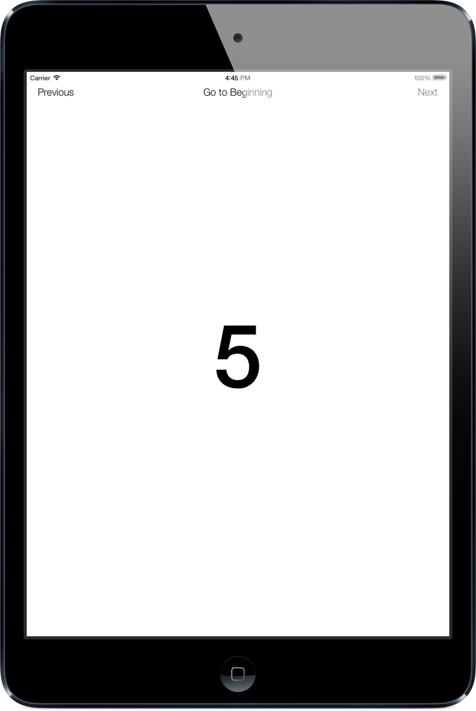

Summary
====

When using UIPageViewController with UIPageViewControllerTransitionStyleScroll, if you advance to a page manually, the next page you swipe to will be incorrect.

Steps to Reproduce:
====
I have attached a simplified Xcode project to demonstrate the bug.

1. Run PageViewControllerBug. It uses a UIPageViewController that contains 10 ViewController instances.
2. If you navigate only by swiping, everything is ok.
3. If you navigate only by touching "Next" or "Previous", everything is ok
4. However, if you touch the "Go to Beginning" button, the UIPageViewController will correctly navigate to Page 1.  However, if you then swipe to the next page, it will be wrong.  It will be the one you were previously on!

For example, swipe from page 1 to page 2 to page 3 to page 4.  Touch the "Go to Beginning" button to return to page 1.  Now swipe to the next page.  It is page 4 when it should be page 2.

Regression:
====
No, this bug existed in iOS 6.1 as well

Notes:
====
This bug is discussed at
http://stackoverflow.com/questions/12939280/uipageviewcontroller-navigates-to-wrong-page-with-scroll-transition-style

In the stackoverflow discussion, Matt is Matt Neuburg, author of Programming iOS 6 from O'Reilly.

The workaround discussed does fix the navigation issue, but it causes the UIPageViewController to leak memory.  The ViewController instances are not dealloc'ed and start to pile up in memory.

I believe this bug is a duplicate of rdar://13162693 however I wanted to take the time to boil it down to an Xcode sample project and test it in the latest iOS 7 beta 2.  The bug is still there and it would be great to get it fixed in iOS 7.